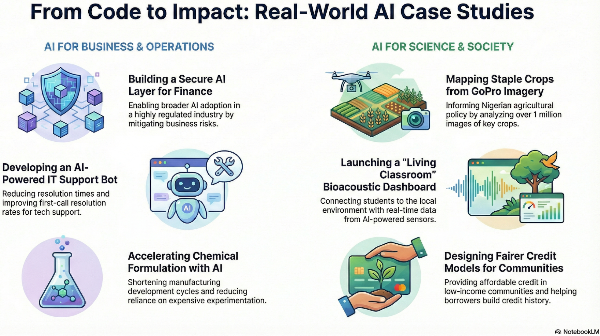

# RSE Course (NSF DARSE)

This repository is the central hub for the NSF DARSE Research Software Engineering course.

  

## Purpose
This repository contains:
- course information and policies
- GitHub workflow and RSE best practices
- links to all case study repositories

⚠️ No project code lives in this repository.

## Course Structure
- Each case study is developed in its own GitHub repository
- Students work via issues, branches, and pull requests
- This repo remains stable throughout the semester

## Case Studies

## Spring 2026

| Case Study | Partner | Repository |
|-----------|---------|------------|
| CHATBVP CONTROL TOWER | BISON VENTURE PARTNERS | https://github.com/nsf-darse/chatbvp-control-tower |
| ACCELERATING CHEMICAL FORMULATION WITH AI/ML | APEX 974 LLC | https://github.com/nsf-darse/ai-physics-chemform-acceleration |
| THE LIVING CLASSROOM -BIOACOUSTIC DASHBOARD | UD: ENTOMOLOGY AND WILDLIFE ECOLOGY | https://github.com/nsf-darse/living-classroom-realtime-learning |
| PHYSICS-AWARE ML FOR CERAMIC MANUFACTURING | UD: COMPUTER & INFORMATION SCIENCES | https://github.com/nsf-darse/physics-aware-ml-ceramics-am |
| SENTINEL: NEXT-GEN AI EXECUTION LAYER | BEST EGG | https://github.com/nsf-darse/sentinel-nextgenai-execution-layer |
| DERIVATION OF EXPERIMENTALLY VALIDATED REGULATORY NETWORKS BASED ON LITERATURE | UD: BIOLOGICAL SCIENCES | https://github.com/nsf-darse/literature-derived-regulatory-networks |
| SECURED CONSUMER LENDING ALTERNATIVE | STEPPING STONES CDFI CREDIT UNION | https://github.com/nsf-darse/secured-consumer-lending-platform |
| GNNS FOR NETWORK INTRUSION DETECTION | LINCOLN UNIVERSITY |  https://github.com/nsf-darse/gnn-intrusion-detection |
| AUTOMATED PROVISIONING & FINANCIAL DATA ANALYTICS | VENDERLY | https://github.com/nsf-darse/venderly-provisioning-finance-automation |
| GRADPATH: ADVISING AI AGENT | LINCOLN UNIVERSITY | https://github.com/nsf-darse/gradpath-ai-advisor |
| AI ENHANCED MSP SUPPORT BOT | DIAMOND TECHNOLOGIES | https://github.com/nsf-darse/ai-msp-support-bot |
| INTELLIGENT TICKET ASSIGNMENT & WORKLOAD MANAGEMENT | DIAMOND TECHNOLOGIES | https://github.com/nsf-darse/intelligent-ticket-assignment-workload-mgmt |
| CROP TYPE DETECTION IN GOPRO IMAGERY | UD: GEOGRAPHY AND SPATIAL SCIENCES | https://github.com/nsf-darse/gopro-crop-type-detection |
